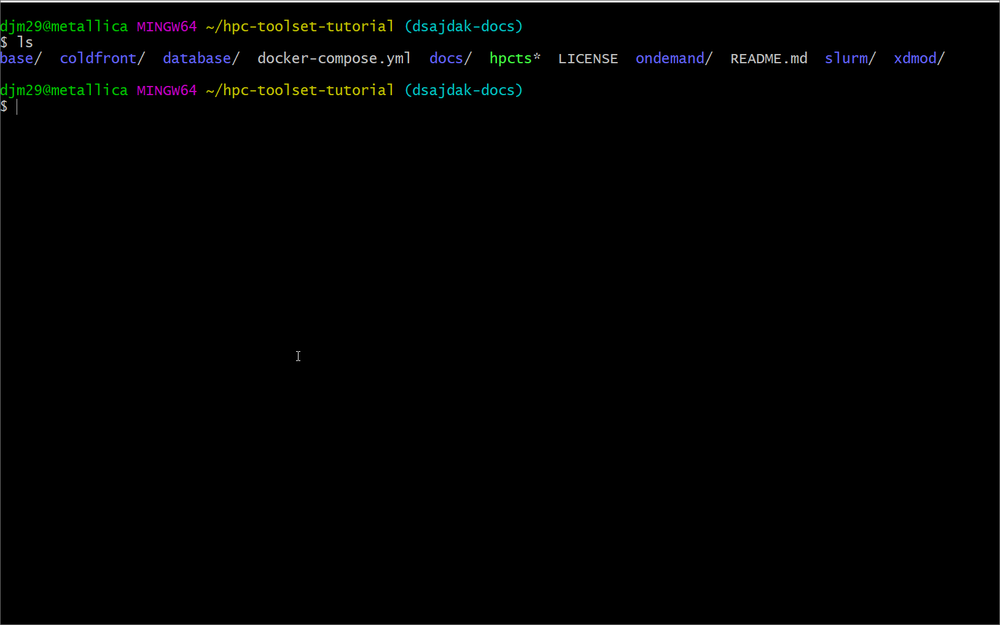

## ColdFront installation
View `hpc-toolset-tutorial/coldfront/install.sh` to see how ColdFront is installed


NOTE: you can also install ColdFront using pip.  See the github repo for more details

## Login to Coldfront container
- Review `hpc-toolset-tutorial/coldfront/local_settings.py`
- This is where you'd enable or disable any plugins and set variables for your local installation

## Login to the frontend
`ssh -p 6222 hpcadmin@localhost`  
- Look at current slurm associations
`sacctmgr show user cgray -s list`

## Login to ColdFront website
- URL https://localhost:2443/
- Login as `admin:admin`
- Go to Admin interface, Users
- Add new user `hpcadmin` password: `ilovelinux`
- Make this user a 'superuser' by checking the boxes next to "Staff Status" and "Superuser Status" - SAVE
- Logout
- Login as `hpcadmin` user
- Add a resource: `cluster, cluster name=hpc, attribute: slurm_cluster=hpc`
- Make `cgray` a PI: Under UserProfile, select `cgray` user and check ``"Is pi"``  SAVE
- Logout
- Login as PI `cgray:test123`
- Create a new project
- Request an allocation for resource: hpc
- Logout
- Login as `hpcadmin`
- Activate the allocation and set the appropriate allocation attributes:  
`slurm_account:cgray, slurm_specs:Fairshare=100, slurm_user_specs:Fairshare=parent`

## Run slurm plugin to sync active allocations from ColdFront to slurm
- Login to the frontend container first, then to the coldfront container:  
`ssh -p 6222 hpcadmin@localhost`  
`ssh coldfront`  
`source venv/bin/activate`  
`cd coldfront`  

- Let's see what slurm access cgray currently has:  
`sacctmgr show user cgray -s list`
- Now dump the slurm account/association info from ColdFront's active allocations:  
`coldfront slurm_dump -c hpc -o /tmp/slurm_dump`
- Let's see what was created:  
`ls -al /tmp/slurm_dump`  
`cat /tmp/slurm_dump/hpc.cfg`  
- Load the slurm dump into slurm database:  
`sacctmgr load file=/tmp/slurm_dump/hpc.cfg`  
`Type 'Y'` to add the new account & associations for cgray
- Let's look at cgray's slurm account again:  
`sacctmgr show user cgray -s list`


## Login (or go back) to frontend container
- check slurm associations for cgray again: they should now show access to the hpc cluster  
`su - cgray`  
`sbatch --wrap "sleep 600"`  
`squeue`  (the job should be running on a node)  
`ssh` to node  
`ps -ef |grep cgray`  

## Login to OnDemand website
- URL https://localhost:3443/ (cgray:test123)
- Go to Active Jobs and click on your running job
- Delete (cancel) the job
- Submit a job using job template
- Launch an interactive Job

## Login to XDMoD website
- URL  https://localhost:4443/ (cgray:test123)
- Change date to include today
- There is currently no data in XDMoD

## Login to Open XDMoD container
- `ssh hpcadmin@xdmod`
- In order to see the job data just generated in slurm, we need to ingest the data into Open XDMoD and aggregate it.  This is normally done once a day on a typical system but for the purposes of this demo, we have created a script that you can run now:
`sudo /srv/xdmod/scripts/shred-ingest-aggregate-all.sh`

The contents of the script are:
```bash
#!/bin/bash
yesterday=`date +%Y-%m-%d --date="-1 day"`
tomorrow=`date +%Y-%m-%d --date="+1 day"`

xdmod-slurm-helper -r hpc --start-time $yesterday --end-time $tomorrow
xdmod-ingestor
indexarchives.py -a
summarize_jobs.py
aggregate_supremm.sh
```

**Note: More information about this script in the Open XDMoD portion of this tutorial

## Login to Open XDMoD website
- URL  https://localhost:4443/ (cgray:test123)
- Change date to include today
- You should see the data from the job you just ran

## Adding new users to project & allocation (time permitting)
- Login to ColdFront as csimmons (ilovelinux) https://localhost:2443/
- Notice there are no projects and no allocations.  Logout
- Login as cgray (test123)
- Click on project
- Click on Add User - search for `csimmons`
- Add to allocation
- Login to coldfront container and re-run slurm plug-in commands to add csimmons to slurm associations  
`ssh coldfront`
- Let's see what slurm access csimmons currently has:  
`sacctmgr show user csimmons -s list`
- Now dump the slurm account/association info from ColdFront's active allocations:  
`coldfront slurm_dump -c hpc -o /tmp/slurm_dump`
- Let's see what was created:  
`ls -al /tmp/slurm_dump`  
`cat /tmp/slurm_dump/hpc.cfg`  
- Load the slurm dump into slurm database:  
`sacctmgr load file=/tmp/slurm_dump/hpc.cfg`  
`Type 'Y'` to add the new association for csimmons
- Let's look at csimmons's slurm account again:  
`sacctmgr show user csimmons -s list`


## Tutorial Navigation
[Next - Open XDMoD](../xdmod/README.md)
[Previous Step - Accessing the Applications](../docs/applications.md)
[Back to Start](../README.md)
