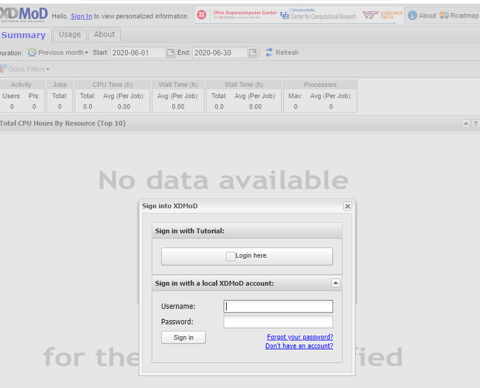

## ColdFront installation & Configuration
- View `hpc-toolset-tutorial/coldfront/install.sh` to see how ColdFront is installed
- View `hpc-toolset-tutorial/coldfront/local_settings.py` to see how ColdFront is configured
- This is where you'd enable or disable any plugins and set variables for your local installation

NOTE: you can also install ColdFront using pip: https://pypi.org/project/coldfront/

## Login to ColdFront website
- URL https://localhost:2443/
- You'll need to login as some of the users for this tutorial to get things started:
- Login locally as username `hpcadmin` password: `ilovelinux`
- Logout
- Login locally as username `cgray` password: `test123`
- Logout
- Login locally as username `admin` password: `admin`
- Go to Admin interface, Users
- Click on the hpcadmin user
- Make this user a 'superuser' by checking the boxes next to "Staff Status" and "Superuser Status" - SAVE
- Go to Admin interface, User Profiles
- Click on `cgray` check ``"Is pi"``  SAVE
- Go back to Admin interface, Click on Resources
- Add a resource: `cluster, cluster name=hpc, attribute: slurm_cluster=hpc`
- Logout
- Login as the PI using local account username: `cgray` password: `test123`
- Create a new project
- Request an allocation for resource: hpc
- Logout
- Login using local account username: `hpcadmin` password: `ilovelinux`  
- Activate the allocation and set the appropriate allocation attributes:  
`slurm_account:cgray, slurm_specs:Fairshare=100, slurm_user_specs:Fairshare=parent`

<figure class="video_container">
  <iframe src="https://drive.google.com/file/d/18YJXrS7rNWZlA9YK84sJbAGDdpAoopG7/view?usp=sharing" frameborder="0" allowfullscreen="true"> </iframe>
</figure>

## Run slurm plugin to sync active allocations from ColdFront to slurm
- Login to the frontend container first, then to the coldfront container:  
`ssh -p 6222 hpcadmin@localhost`  
password: `ilovelinux`  
`ssh coldfront`  
`cd /srv/www`  
`source venv/bin/activate`  
`cd coldfront`  

- Let's see what slurm access cgray currently has:  
`sacctmgr show user cgray -s list`
- Now dump the slurm account/association info from ColdFront's active allocations:  
`coldfront slurm_dump -c hpc -o ~/slurm_dump`
- Let's see what was created:  
`ls -al ~/slurm_dump`  
`cat ~/slurm_dump/hpc.cfg`  
- Load the slurm dump into slurm database:  
`sacctmgr load file=~/slurm_dump/hpc.cfg`  
`Type 'Y'` to add the new account & associations for cgray
- Let's look at cgray's slurm account again:  
`sacctmgr show user cgray -s list`  
- Logout of ColdFront container  
`exit`  

## Login (or go back) to frontend container
NOTE: you should already be on the frontend but just in case you're not:  
`ssh -p 6222 hpcadmin@localhost`  
password: `ilovelinux`  

Check slurm associations for cgray again: they should now show access to the hpc cluster  
`sacctmgr show user cgray -s list`    
`su - cgray`  
password: `test123`  
`sbatch --wrap "sleep 600"`  
`squeue`  (the job should be running on a node)  
`ssh` to the allocated node  
`ps -ef |grep cgray`  
`exit` (logout from compute node)  
`exit` (logout from cgray account)  

## Login to OnDemand website
- Login to Open OnDemand  https://localhost:3443/ as username: `cgray` password: `test123`
- Go to Active Jobs and click on your running job
- Delete (cancel) the job
- Submit a job using job template
- Launch an interactive Job

<iframe src="https://drive.google.com/file/d/1CWF6Xlig5EJWgENK-mPmZB2vXhjhbHcb/view?usp=sharing" frameborder="0" allowfullscreen="true"> </iframe>

## Login to Open XDMoD website
- Login to Open XDMoD https://localhost:4443/  
 -- Click on 'Sign In' at the top left  
 -- Under the section "Sign in with local XDMoD account:"  Click on "Login Here" and enter username: `admin` password: `admin`  
- Notice there is currently no data in XDMoD

## Login to Open XDMoD container
- `ssh hpcadmin@xdmod`  
password: `ilovelinux`  
- In order to see the job data just generated in slurm, we need to ingest the data into Open XDMoD and aggregate it.  This is normally done once a day on a typical system but for the purposes of this demo, we have created a script that you can run now:  
`sudo -u xdmod /srv/xdmod/scripts/shred-ingest-aggregate-all.sh`  
`exit`  

**Note: More information about this script in the Open XDMoD portion of this tutorial**

## Login to Open XDMoD website
- Login to Open XDMoD https://localhost:4443/  
 -- Click on 'Sign In' at the top left  
 -- Under the section "Sign in with tutorial:"  Click on "Login Here" and enter username: `cgray` password: `test123`  
- You should see the data from the job you just ran  
NOTE: There won't be much info except that we ran a few jobs. More will be presented in the XDMoD portion of the tutorial

## Adding new users to project & allocation (time permitting)
- Login to ColdFront https://localhost:2443/ with locally as username: `csimmons` password: `ilovelinux`   
 **NOTE:**  You'll need to use a separate browser or incognito window as you'll already be logged in using the single sign on with XDMoD and OnDemand.
- Notice there are no projects and no allocations.  Logout
- Login locally as username `cgray` password: `test123`
- Click on project
- Click on Add User - search for `csimmons`
- Add to allocation
- Login to coldfront container and re-run slurm plug-in commands to add csimmons to slurm associations  
`ssh coldfront`
- Let's see what slurm access csimmons currently has:  
`sacctmgr show user csimmons -s list`
- Now dump the slurm account/association info from ColdFront's active allocations:  
`coldfront slurm_dump -c hpc -o /tmp/slurm_dump`
- Let's see what was created:  
`ls -al /tmp/slurm_dump`  
`cat /tmp/slurm_dump/hpc.cfg`  
- Load the slurm dump into slurm database:  
`sacctmgr load file=/tmp/slurm_dump/hpc.cfg`  
`Type 'Y'` to add the new association for csimmons
- Let's look at csimmons's slurm account again:  
`sacctmgr show user csimmons -s list`

## Tutorial Navigation
[Next - Open XDMoD](../xdmod/README.md)  
[Previous Step - Accessing the Applications](../docs/applications.md)  
[Docker Tips](../docs/docker_tips.md)  
[Back to Start](../README.md)
