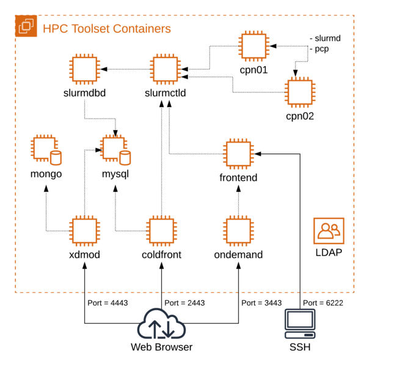
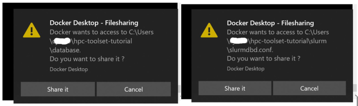
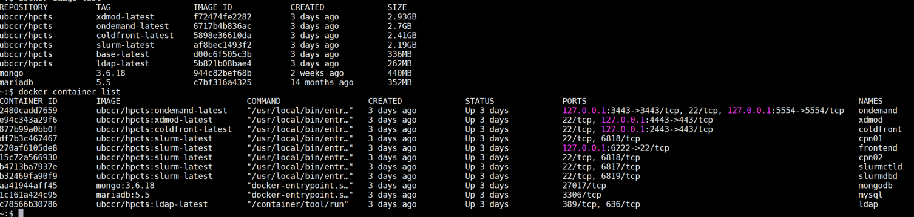

## Overview

In this tutorial we present three open source projects that form a core set of utilities commonly installed at High Performance Computing (HPC) centers.

An overview of the containers in the cluster:



## Requirements

If you haven't already installed and tested the required packages, please refer to the [requirements page](requirements.md)

## Getting started

You will need to clone the tutorial repo and then run the helper script.  The first time running this, you'll be downloading all the containers from Docker Hub.  This can take quite a long time depending on your network speed.  The images total approximately 7GB in size.  Once the containers are downloaded, they are started and the services launched.  For point of reference: on a recent test from a home fiber optic network this download and container startup process took 17 minutes.  

NOTE: For Windows, if you haven't already done so, you will need to configure git not to convert line endings into Windows format.  Run this command using the git-bash shell application before cloning the tutorial repo:

```
git config --global core.autocrlf input
```

### Clone Repo and Start Containers

```
$ git clone https://github.com/ubccr/hpc-toolset-tutorial.git
$ cd hpc-toolset-tutorial
$ ./hpcts start
Fetching latest HPC Toolset Images..

Pulling ldap      ... done
Pulling base      ... done
Pulling mongodb   ... done
Pulling mysql     ... done
Pulling slurmdbd  ... done
Pulling slurmctld ... done
Pulling cpn01     ... done
Pulling cpn02     ... done
Pulling frontend  ... done
Pulling coldfront ... done
Pulling ondemand  ... done
Pulling xdmod     ... done

Starting HPC Toolset Cluster..

Creating network "hpc-toolset-tutorial_compute" with the default driver
Creating volume "hpc-toolset-tutorial_etc_munge" with default driver
Creating volume "hpc-toolset-tutorial_etc_slurm" with default driver
Creating volume "hpc-toolset-tutorial_home" with default driver
Creating volume "hpc-toolset-tutorial_var_lib_mysql" with default driver
Creating volume "hpc-toolset-tutorial_data_db" with default driver
Creating volume "hpc-toolset-tutorial_srv_www" with default driver
Creating mysql   ... done
Creating ldap    ... done
Creating mongodb ... done
Creating hpc-toolset-tutorial_base_1 ... done
Creating slurmdbd                    ... done
Creating slurmctld                   ... done
Creating frontend                    ... done
Creating cpn02                       ... done
Creating cpn01                       ... done
Creating coldfront                   ... done
Creating xdmod                       ... done
Creating ondemand                    ... done

Coldfront URL: https://localhost:2443


OnDemand URL: https://localhost:3443


XDMoD URL: https://localhost:4443


Login to frontend: ssh -p 6222 hpcadmin@localhost


```

**NOTE:  Despite seeing this output with URLs, the processes on these containers may not be fully running yet.  Depending on the speed of your computer, starting up the processes may take a few minutes (or even up to 10 minutes).  Use the command below to check the docker logs if the websites are not yet displaying.**

NOTE: Windows users will get several pop-up messages from Docker Desktop during this process asking to allow local system access to the Docker containers.  Please click the "Share it" button:



### Error when starting up tutorial containers

If you get this error when starting the tutorial:  

```
ERROR: Couldn't connect to Docker daemon at http+docker://localunixsocket - is it running?

or  

ERROR: Couldn't connect to Docker daemon at http+docker://localhost - is it running?
```

Try stopping and starting Docker (restart doesn't usually fix the problem).  Commands for this differ depending on operating system.  

If the error persists, try:  

```
export DOCKER_HOST=127.0.0.1
```

NOTE: this is only necessary on some systems so don't use it if the previous command works

**Sometimes restarting your operating system is the only solution.**


### Docker Logs

Once the helper script finishes you can check the status of the containers:

```
$ docker-compose logs -f
mysql        | 200620  4:03:42 [Note] Event Scheduler: Loaded 0 events
mysql        | 200620  4:03:42 [Note] mysqld: ready for connections.
frontend     | ---> Starting the MUNGE Authentication service (munged) ...
frontend     | ---> Starting sshd on the frontend...
cpn01        | slurmd: Munge credential signature plugin loaded
cpn01        | slurmd: CPUs=1 Boards=1 Sockets=1 Cores=1 Threads=1 Memory=15575 TmpDisk=229951 Uptime=43696 CPUSpecList=(null) FeaturesAvail=(null) FeaturesActive=(null)
cpn02        | slurmd: debug:  AcctGatherEnergy NONE plugin loaded
coldfront    | -- Waiting for database to become active ...
coldfront    | -- Initializing coldfront database...
ondemand     | ---> Starting ondemand httpd24...
slurmdbd     | slurmdbd: debug2: DBD_NODE_STATE_UP: NODE:cpn01 REASON:(null) TIME:1592625828
slurmctld    | slurmctld: SchedulerParameters=default_queue_depth=100,max_rpc_cnt=0,max_sched_time=2,partition_job_depth=0,sched_max_job_start=0,sched_min_interval=2
xdmod        | 2020-06-21 19:23:48 [notice] xdmod-ingestor end (process_end_time: 2020-06-21 19:23:48)
xdmod        | ---> Starting XDMoD...
```

## Something still not right?

If errors are showing up in the logs or the services have not all started, check to see which images have been downloaded and which containers are running.  This is what you should see:  
  

If not, run the 'stop' option of the helper script to shut everything down and remove all volumes.  Then start everything back up again:  

```
$ ./hpcts stop
$ docker container list
(Should show no containers)

$ docker volume list
(Should show no volumes)
```

If either of the above do, you should run the corresponding remove command:  

```
$ docker container rm [ContainerID]
$ docker volume rm [VolumeName]
```

Then start it all up again:  

```
./hpcts start
```

Since you already downloaded all the images, this command will only startup the containers and services which only takes a few minutes.  

To completely start over, run:  

```
$ ./hpcts cleanup
$ ./hpcts start
```

Just in case none of this worked here are [more Docker tips](docker_tips.md)


## Tutorial Navigation
[Next - Accessing the Applications](applications.md)  
[Docker Tips](docker_tips.md)  
[Back to Start](../README.md)
