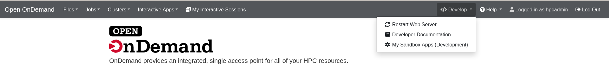
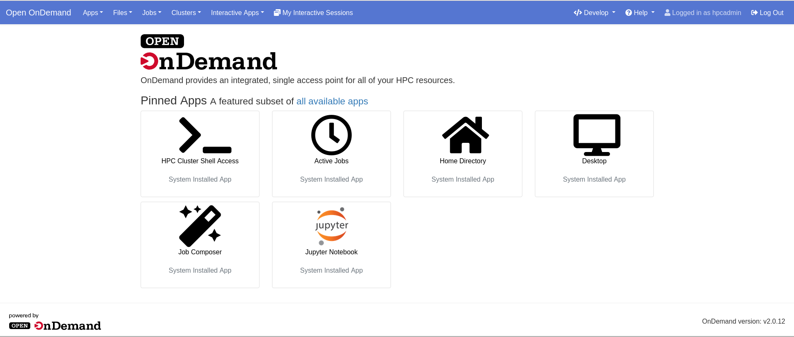
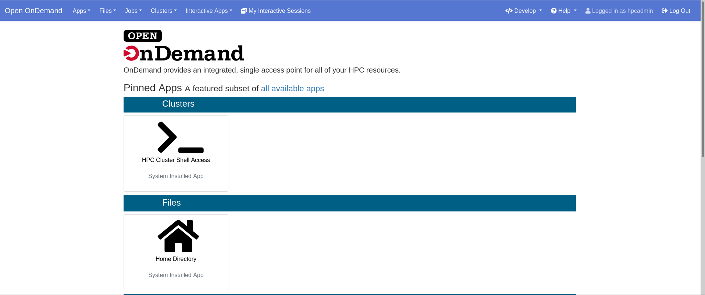
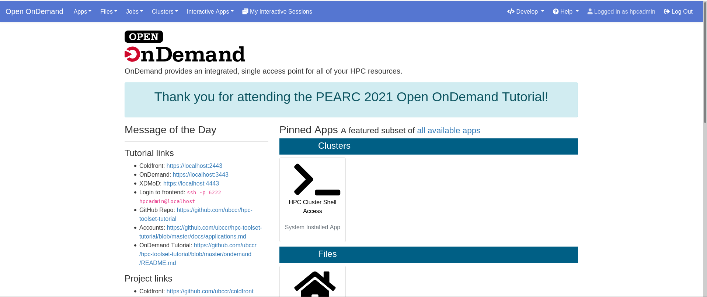
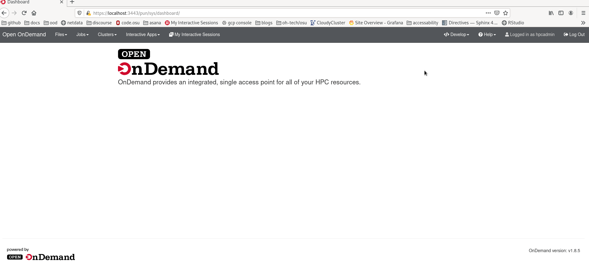
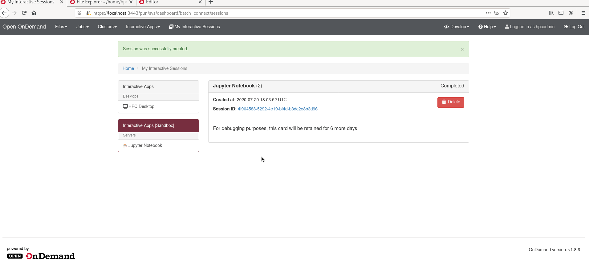
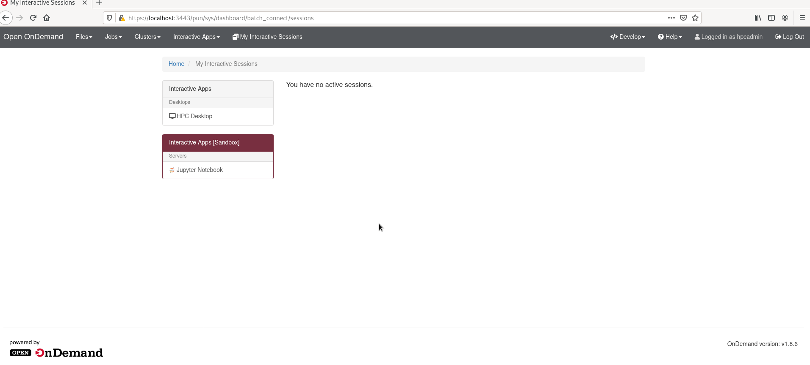
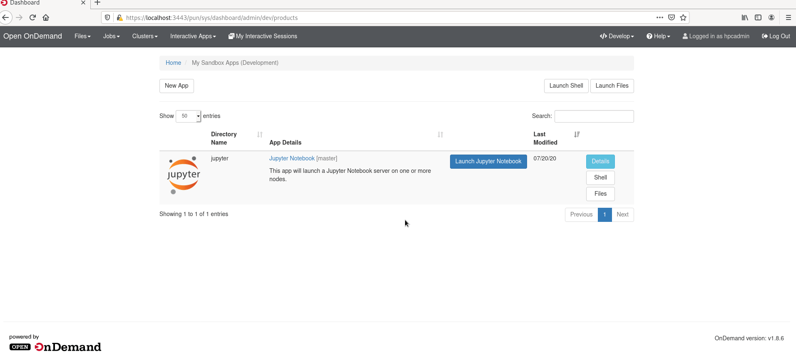

# Open OnDemand Tutorial

## Table of Contents

Live tutorial steps we took during PEARC. See the PEARC video recording to follow along (with images and explanations!):

- [Dashboard-developer-mode-tutorial](#dashboard-developer-mode-tutorial)
- [Jupyter App Tutorial](#jupyter-app-tutorial)
- [Dynamic Batch Connect Fields](#dynamic-batch-connect-fields)
- [Passenger App Tutorial](#passenger-app-tutorial)
- [XDMoD Integration Tutorial](#xdmod-integration-tutorial)

These tutorial will be using the the `hpcadmin` credentials listed in
[Accessing the Applications](../docs/applications.md).

## External links

- [Online Documentation](https://osc.github.io/ood-documentation/master/)
- [Jupyter Install Tutorial](https://osc.github.io/ood-documentation/master/app-development/tutorials-interactive-apps/add-jupyter.html)

## Getting Started

### Login

Now you should login to Open OnDemand through https://localhost:3443.  Note that you'll have to
accept the self-signed certificates from both Open OnDemand and the identity provider.

### Get a shell session

At some points during this tutorial you'll need to execute commands in a shell session.
You can [use the shell app](https://localhost:3443/pun/sys/shell/ssh/ondemand)
to get an ssh session in the web browser for this purpose.

## Dashboard developer mode Tutorial

This tutorial covers:

- [Starting the dashboard in development mode](#starting-the-dashboard-in-development-mode)
- [Changing the color of the navbar](#changing-the-navbar-color)
- [Pinning apps to the dashboard](#pinning-apps)
- [Changing the dashboard layout](#changing-the-dashboard-layout)
- [Add a custom widget to the dashboard](#add-a-custom-widget-to-the-dashboard)

### Starting the dashboard in development mode

First we need to pull the source code from the Github Repository. Let's
[use the shell app](https://localhost:3443/pun/sys/shell/ssh/ondemand) for this.

Be sure to be on the `ondemand` host because that container has node and ruby on it,
which we need to build the project.

If you are not using the shell app, use `ssh` to connect to the `ondemand` host from the `frontend` host: `ssh ondemand`

Then, do the following:

```text
git clone https://github.com/OSC/ondemand.git ~/ondemand-src-full
mkdir -p ~/ondemand/dev
cd ~/ondemand/dev
ln -s ../../ondemand-src-full/apps/dashboard/ dashboard
cd dashboard
git checkout release_2.0
bin/bundle config --local path vendor/bundle
bin/setup
```

** NOTE: M1 Mac users need to run the following commands BEFORE `bin/setup`:

```
bundle config build.nokogiri --use-system-libraries
bundle config set force_ruby_platform true
bin/setup
```

Once you run `bin/setup` you should see a bunch of output about getting Rugy gems and building
Node.js packages.

If you've successfully setup, then so you should be able to
[navigate to the development version of the dashboard](https://localhost:3443/pun/dev/dashboard)
where you'll have to click the button to 'Initialize App' to move forward.

That's it! At this point you should be viewing the dashboard in the development mode.  This means
that it's _your own version_ of the dashboard. You can modify this as you see fit without having
to escalate privileges (become root) or disrupt other users.

### Changing the navbar color

We'll need to create and edit an environment file for our development dashboard to read.

```text
# /home/hpcadmin/ondemand/dev/dashboard/.env.local

# you can use pretty names like 'blue' or hex codes like '#5576d1' for royal blue
# OOD_BRAND_BG_COLOR='blue'
OOD_BRAND_BG_COLOR='#5576d1'
```

Now you may have to restart the server with the button at the top right to see the
changes take place.



### Pinning Apps

Now we're going to enable a new feature in 2.0 which is pinning app icons to the dashboard.

First we're going to have to reconfigure the `OOD_CONFIG_D_DIRECTORY` environment variable.
It defaults to `/etc/ood/config/ondemand.d`, but since we don't want to privilege escalate,
we're going to make a new directory in our home.

```text
mkdir -p ~/ondemand/config/ondemand.d
touch ~/ondemand/config/ondemand.d/ondemand.yml
```

```text
# /home/hpcadmin/ondemand/dev/dashboard/.env.local

OOD_CONFIG_D_DIRECTORY="/home/hpcadmin/ondemand/config/ondemand.d"
```

Now let's [edit the ondemand.yml](https://localhost:3443/pun/sys/dashboard/files/edit/home/hpcadmin/ondemand/config/ondemand.d/ondemand.yml)
file that we initialized above to add the configuration.

```yaml
# /home/hpcadmin/ondemand/config/ondemand.d/ondemand.yml

pinned_apps:
  - 'sys/*'
```

Restart the dashboard and you should see pinned apps show up.



Now let's group them by their `category` by adding this configuration to the same `ondemand.yml` file.

```yaml
# /home/hpcadmin/ondemand/config/ondemand.d/ondemand.yml

pinned_apps:
  - 'sys/*'

pinned_apps_group_by: 'category'
```

Another restart of the webserver will pick up these configurations and you should see pinned apps
are now grouped by the category of the application.



See [the documentation on pinned apps](https://osc.github.io/ood-documentation/latest/customization.html#pinning-applications-to-the-dashboard)
for more information.

### Changing the dashboard layout

First we're going to enable the message of the day (MOTD)

Let's add these two environment variables to our `~/ondemand/dev/dashboard/.env.local` file.

```text
# /home/hpcadmin/ondemand/dev/dashboard/.env.local

MOTD_PATH=/etc/motd
MOTD_FORMAT=markdown
```

Restart your webserver and you should now see the MOTD to the right of the page.

Now, just to demonstrate this feature, let's move the MOTD to the left of the page with pinned
app icons being on the right.

```yaml
# /home/hpcadmin/ondemand/config/ondemand.d/ondemand.yml

dashboard_layout:
  rows:
    - columns:
        - width: 4
          widgets: [ motd ]
        - width: 8
          widgets: [ pinned_apps ]
```

See the [documentation on customizing the dashboard layout](https://osc.github.io/ood-documentation/latest/customization.html#custom-layouts-in-the-dashboard)
for more information.

### Add a custom widget to the dashboard

Now that we've changed the layout of the dashboard, let's extend this feature to add a brand new widget.

First, we need to reconfigure where widgets are picked up from.  By default they're in `/etc/ood/config/apps/dashboard/views/widgets`,
but because we don't want to become root to do this, we're going to reconfigure this location.

So we're going to add these entries to our local environment file.

```text
# /home/hpcadmin/ondemand/dev/dashboard/.env.local

OOD_LOAD_EXTERNAL_CONFIG=1
OOD_APP_CONFIG_ROOT="/home/hpcadmin/ondemand/config"
```

Next, in a shell, let's initialize some directories and the widget file.

```text
mkdir -p ~/ondemand/config/views/widgets
touch ~/ondemand/config/views/widgets/_hello_world.html
```

Be sure to add the underscore prefix to this filename! This is a Rails convention for partials and not a mistype
it is indeed `_hello_world.html`.

Now, we can use the [file editor to edit our new widget](https://localhost:3443/pun/sys/dashboard/files/edit/home/hpcadmin/ondemand/config/views/widgets/_hello_world.html).  Let's add this very simple div to just thank you for being here. Of course, you can put
any text you like here. Feel free to have fun with it!

```html
<!-- /home/hpcadmin/ondemand/config/views/widgets/_hello_world.html -->
<div class='alert alert-info text-center' style='font-size:2.2rem;'>
    <p>Thank you for attending the PEARC 2022 Open OnDemand Tutorial!</p>
</div>
```

Now that we have the widget, we need to add it to the layout. Let's make a new row for it and push everything
else to the second row.  This new row will have only one twelve width column that has our new `hello_world`
widget.

```yaml
# /home/hpcadmin/ondemand/config/ondemand.d/ondemand.yml

dashboard_layout:
  rows:
    - columns:
        - width: 12
          widgets: [ hello_world ]
    - columns:
        - width: 4
          widgets: [ motd ]
        - width: 8
          widgets: [ pinned_apps ]
```

Now your dashboard should look something like this with a brand new widget we just creating showing up on the
dashboard.



## Jupyter App Tutorial

This tutorial covers:

- [Initializing the developer application.](#create-the-jupyter-application)
- [Debugging the app and getting it to run correctly.](#get-jupyter-working)
- [Changing the type of a form option.](#change-bc_queue-to-a-select-field)
- [Adding limits for form options.](#limit-bc_num_slots)
- [Adding new form options.](#adding-a-jupyterlab-checkbox)
- [Using native scheduler arguements](#using-script-native-attributes)
- [Explanations of the form.yml file.](#a-closer-look-at-the-formyml)
- [Editing the manifest.yml](#edit-the-manifest).
- [Promoting the application to production.](#deploying-to-production)

### Create the jupyter application

Click on "My Sandbox Apps (Development)" from the dropdown menu "Develop" in the navigation bar
to navigate to the sandbox app workspace.

Now create a new app from the button labeled "New App".

This will bring you to a page where you'll click "Clone Existing App" which will bring you to
this form to fill out.  

Fill in `jupyter` as the directory name. `/var/git/bc_example_jupyter` as the Git Remote and
check "Create a new Git Project from this?".  Then click "Submit" to create a new development
application.

This copied what was in `/var/git/bc_example_jupyter` to `/home/hpcadmin/ondemand/dev/jupyter`.
You can navigate to these files [through the Files app with this link](https://localhost:3443/pun/sys/files/fs/home/hpcadmin/ondemand/dev/jupyter/)
or simply Press the "Files" button in Jupyter's row of the sandbox applications table.



You'll also need to setup `git` for the hpcadmin user at this point, so let's go ahead and do that
and make first commit to the jupyter app as the starting point.

```shell
git config --global user.email hpcadmin@localhost
git config --global user.name "HPC Admin"
cd ~/ondemand/dev/jupyter
git add .
git commit -m 'starting point'
```

### Get Jupyter Working

#### Configure the correct cluster

The example application we've created does not use the correct cluster configuration, so we've got
to modify it.

If you try to submit it as is, you'll get this error:


We need to edit the `form.yml` in the appication's folder. We can navigate to the folder through the
files app.  The URL is `https://localhost:3443/pun/sys/files/fs/home/hpcadmin/ondemand/dev/jupyter/`.

Here you'll see the `form.yml` file. We can edit it by clicking on the file and pressing the "Edit"
button.  This will take us to the [file editor app, with this file open](https://localhost:3443/pun/sys/file-editor/edit/home/hpcadmin/ondemand/dev/jupyter/form.yml)

In the file Editor, specify `hpc` as the cluster attribute on line 11 like so: `cluster: "hpc"`. Save this file by clicking
the "Save" button at the top left.

#### Launch the Jupyter Application

Now when we navigate back to our [interactive sessions](https://localhost:3443/pun/sys/dashboard/batch_connect/sessions),
you'll see the "Interactive Apps \[Sandbox\]" menu with an item labeled "Jupyter Notebook".

[Follow this link](https://localhost:3443/pun/sys/dashboard/batch_connect/dev/jupyter/session_contexts/new) and we'll be
presented with this form for specifying different attributes about the job we want to submit to the SLURM scheduler.

We don't need to change anything in this form, so simply press "Launch" at the bottom of the form. After pressing
launch the job should have successfully launched the job and redirected us back
the [interactive sessions](https://localhost:3443/pun/sys/dashboard/batch_connect/sessions) page where we'll
see a panel showing our job.  


#### Debug failure

This job is going to run and fail during startup.  But don't worry! We're going to debug and fix it.

When the job completes, the panel still exists, so you can follow the link in the panel to the log
directory of the job.

Follow the link and we'll be redirected to the job's working directory where an `output.log` file is.
Let's open that file with the "View" button.

When you open the log file, you'll see the something like this where it says **jupyter: command not found**.
So you can see, we have `PATH` issues.

```shell
TIMING - Starting jupyter at: Fri Jul 17 18:06:34 UTC 2020
+ jupyter notebook --config=/home/hpcadmin/ondemand/data/sys/dashboard/batch_connect/dev/jupyter/output/e16b9a77-1a4f-4c9e-95f3-d3c23e5e8d76/config.py
/home/hpcadmin/ondemand/data/sys/dashboard/batch_connect/dev/jupyter/output/e16b9a77-1a4f-4c9e-95f3-d3c23e5e8d76/script.sh: line 27: jupyter: command not found
Timed out waiting for Jupyter Notebook server to open port 16970!
```

#### Configure jupyter PATH

So we know what the issue is, the job's script can't find the `jupyter` executable in the `PATH`.

Jupyter was installed in these containers through Python's virtual environment and that's
why it's not directly in the shell scripts `PATH`.

We need to add this line to our job's shell script to enable it.

```shell
source /usr/local/jupyter/2.1.4/bin/activate
```

So let's [open the template/script.sh.erb in the file editor](https://localhost:3443/pun/sys/file-editor/edit/home/hpcadmin/ondemand/dev/jupyter/template/script.sh.erb)
and add this to line 27 of the shell script, just before we start jupyter.

Lines 24 - 31 of `template/script.sh.erb` should now look like this.

```shell
# Benchmark info
echo "TIMING - Starting jupyter at: $(date)"

source /usr/local/jupyter/2.1.4/bin/activate

# Launch the Jupyter Notebook Server
set -x
jupyter notebook --config="${CONFIG_FILE}" <%= context.extra_jupyter_args %>
```

#### Correctly launch

Now we can [launch the application again](https://localhost:3443/pun/sys/dashboard/batch_connect/dev/jupyter/session_contexts/new) and it should work.

When it is up and running and available to use the panel will show a "Connect to Jupyter" button.  Click this button
and OnDemand will redirect us to Jupyter.  



Congratulations! We've now started development on the Jupyter Notebook batch connect application and
successfully connected to it.

You may want to delete this job now by using the "Delete" button on the panels as we'll be iterating through
developing the application and starting new jobs.

#### Save your spot

Now it's probably a good idea to save the modifications. They're small, but it'll still help if you
ever get into trouble and need to revert. A simplified version of the `form.yml` is in the very next
section, and you may want to use and save _it_ instead so that any `git diff` you do will be much
smaller and easier to read.

You can use the
[shell app to login to this directory](https://localhost:3443/pun/sys/shell/ssh/ondemand/home/hpcadmin/ondemand/dev/jupyter/)

In this shell you'll save in git with these commands:

```shell
git add .
git commit -m 'initial commit that correctly submits to the hpc cluster'
```



### A closer look at the form.yml

The items in the form.yml directly create what's shown to the users in the form they interact with.
Let's take a closer look at the `form.yml` that created the form you just submitted to get an
understanding of how they relate to what's shown in the UI.

This is the `form.yml` you should have at this point without all the comments.

```yaml
cluster: "hpc"
attributes:
  modules: "python"
  extra_jupyter_args: ""
form:
  - modules
  - extra_jupyter_args
  - bc_account
  - bc_queue
  - bc_num_hours
  - bc_num_slots
  - bc_email_on_started
```

All fields pre-pended with `bc_` are special fields OnDemand provides for convenience. They are commonly
used fields that create corresponding script attribute.  We'll talk more about script attributes later.

* `modules` Specifies the modules loaded. Since it's hard coded to "python" (in the attributes) 
    we didn't see it in the form.
* `extra_jupyter_args` Specifies the extra jupyter arguments but since it's hard coded to "" we didn't
    didn't see it in the form.
* `bc_account` Creates the "Account" text field and submits the job with the given account.
* `bc_queue` Creates the "Partition" text field and submits the job to the given partition.
* `bc_num_hours` Creates the "Number of hours" integer field and submits the job with the given
    walltime.
* `bc_num_slots` Creates the "Number of nodes" integer field and submits the job with the requested
    cores.
* `bc_email_on_started` Creates the "I would like to receive an email when the session starts" checkbox
    and submits the job with a request to email when the job starts.

### Updating the Jupyter App

#### Change bc_queue to a select field

We have 2 partitions enabled in the SLURM containers (SLURM calls queues partitions, so we'll be switching
back and forth between the two terms in this tutorial). We've started with a field `bc_queue` that
is a text field, but it's likely much easier for users to simply choose the partition out of a
select dropdown menu instead.

So let's replace the `bc_queue` field in the form with a new field that we'll call `custom_queue`.

We'll also add `custom_queue` to the attributes section.  Adding a field to the form section adds it to the form
in the UI.  By default, this field will be a text field. If you want this field to be a different type of widget
(as we do) you'll configure the field in the attributes section.  Also by default the label in the UI is the
same just the name of the field. In our case `custom_queue` would turn into "Custom Queue".  This is only
slightly correct, so we want to specify the label as "Partition" because that's what it is in SLURM parlance.

Here you can see that we specify the `custom_queue` in the attributes as a select widget with two options.
and a new label. The first element in options arrays is what will be shown to the user (the capitalized version)
where the second element is the value what's actually used in the sbatch command.

```yaml
# form.yml, with only this addition for brevity
attributes:
  custom_queue:
    widget: "select"
    label: "Partition"
    options:
      - ["Compute", "compute"]
      - ["Debug", "debug"]
form:
  - custom_queue
#   - bc_queue
```

Refresh the [new session form](https://localhost:3443/pun/sys/dashboard/batch_connect/dev/jupyter/session_contexts/new)
and you should now see your updates.

But before we submit to test them out, we'll need to reconfigure the `submit.yml.erb` to use this
new field.  You can
[edit the submit.yml.erb in the file editor app](https://localhost:3443/pun/sys/file-editor/edit/home/hpcadmin/ondemand/dev/jupyter/submit.yml.erb).

You'll need to specify the script's queue_name as the partition like so. The `script` is the logical
"script" we're submitting to the scheduler.  And the `queue_name` is the field of the script that will
specify the queue. (OnDemand knows how to translate it from queue_name into partition for SLURM).

```yaml
script:
  queue_name: "<%= custom_queue %>"
```

The .erb file extension indicates this is embedded ruby file. This means that Ruby will template this file
and turn it into a yml file that OnDemand will then read.  `<%=` and `%>` are embedded ruby tags to turn the
variable (or expression) into a string. Anything we've defined in the `form.yml` can be used in this ERB file.
In this example we just defined `custom_queue` in the form so we can use it directly here.

If you're not super comfortable with the terminology just remember this: `custom_queue` is defined in the `form.yml`
(the file that defines what the UI form looks like) so it can be used in the `submit.yml.erb` (the file
that is used to configure the job that is being submitted) as `<%= custom_queue %>`.

When [launch the application again](https://localhost:3443/pun/sys/dashboard/batch_connect/dev/jupyter/session_contexts/new) 
you can [login to a shell](#get-a-shell-session) and confirm you chose a different queue with this command.

```shell
[hpcadmin@ondemand ~]$ squeue -o "%j %P"
NAME PARTITION
sys/dashboard/dev/jupyter debug
```


At this point, this should be the entirety of the `submit.yml.erb` and `form.yml` (without comments).
They're given here in full if you want to copy/paste them. And remember to [save your spot](#save-your-spot)!

```yaml
# submit.yml.erb
script:
  queue_name: "<%= custom_queue %>"
```

```yaml
# form.yml
cluster: "hpc"
attributes:
  modules: "python"
  extra_jupyter_args: ""
  custom_queue:
    widget: "select"
    label: "Partition"
    options:
      - ["Compute", "compute"]
      - ["Debug", "debug"]
form:
  - modules
  - extra_jupyter_args
  - bc_account
  - custom_queue
  - bc_num_hours
  - bc_num_slots
  - bc_email_on_started
```

#### Limit bc_num_slots

SLURM is configured with only 2 nodes total.  If you were now to submit this app
with say 3 or more `bc_num_slots` it would sit in the queue forever because SLURM
cannot find a suitable host to run it on.

So, let's limit this field to a max of 2.

```yaml
# form.yml
attributes:
  bc_num_slots:
    max: 2
```

That's it! Again, because `bc_num_slots` is convenience field, it already has a minimum of 1
that you can't override, because it doesn't make sense to specify 0 or less nodes.

#### Using script native attributes

`script.native` attributes are way for us to specify _any_ arguments to the schedulers that
we can't pre-define or have a good generic definition like `queue_name` above.

In this section we're going to put make OnDemand request memory through the sbatch's
`--mem` argument.

First, let's add it to the form like so.

Here are descriptions of all the fields we'll apply to it.  Note if the label was not
not defined the default 'Memory' would have been OK.  Also we don't really need the
the help message here, it was really just for illustration.

* `widget` specifies the type of widget to be a number
* `max` the maximum value, ~1 GB in this case
* `min` the minimum value, 200 MB
* `step` the step size when users increase or decrease the value
* `value` the default value of 600 MB
* `label` the for UIs label
* `help` a help message

```yaml
# form.yml, with only this addition for brevity
attributes:
  memory:
    widget: "number_field"
    max: 1000
    min: 200
    step: 200
    value: 600
    label: "Memory (MB)"
    help: "RSS Memory"
form:
  - memory
```

Again, now to actually use the value we populate in the form, we need to use
it in the `submit.yml.erb`.  This is where `script.native` attributes come in.

```yaml
# submit.yml.erb
script:
  native:
    - "--mem"
    - "<%= memory %>M"
```

Native attributes are an array and they're passed to the schedule just as they're
defined here.

This would translate into a command much like: `sbatch --mem 800M`.  As you can see
native allows us to pass _anything_ we wish into the scheduler command.

To confirm your job is running with the correct memory parameters, simply
[login to a shell](#get-a-shell-session) and run the command below. You should see output like this.

```shell
[hpcadmin@ondemand /]$ squeue -o "%j %m"
NAME MIN_MEMORY
sys/dashboard/dev/jupyter 800M
```

At this point, this should be the entirety of the `submit.yml.erb` and `form.yml` (without comments).
They're given here in full if you want to copy/paste them. And remember to [save your spot](#save-your-spot)!

```yaml
# script.yml.erb
---
script:
  queue_name: "<%= custom_queue %>"
  native:
    - "--mem"
    - "<%= memory %>M"
```

```yaml
# form.yml
cluster: "hpc"
attributes:
  modules: "python"
  extra_jupyter_args: ""
  custom_queue:
    widget: "select"
    label: "Partition"
    options:
      - ["Compute", "compute"]
      - ["Debug", "debug"]
  bc_num_slots:
    max: 2
  memory:
    widget: "number_field"
    max: 1000
    min: 200
    step: 200
    value: 600
    label: "Memory (MB)"
    help: "RSS Memory"
form:
  - modules
  - extra_jupyter_args
  - bc_account
  - custom_queue
  - bc_num_hours
  - bc_num_slots
  - bc_email_on_started
  - memory
```

#### Adding a jupyterlab checkbox

Jupyter ships with both Notebooks and JupyterLab. Some users may want to
use JuypterLab instead of Notebooks, so let's give them that option.

First, let's add the checkbox to the form.

```yaml
# form.yml, with only this addition for brevity
attributes:
  jupyterlab_switch:
    widget: "check_box"
    label: "Use JupyterLab instead of Jupyter Notebook?"
    help: |
      JupyterLab is the next generation of Jupyter, and is completely compatible with existing Jupyter Notebooks.
form:
  - jupyterlab_switch
```

Refresh the [new session form](https://localhost:3443/pun/sys/dashboard/batch_connect/dev/jupyter/session_contexts/new)
and you should now see your updates.

For this change, there's no need to edit the `submit.yml.erb`.  This toggle happens in the
actual script that's ran during the job, so we have to edit `template.sh.erb`.  Note that
this is also an ERB script, so it gets templated in Ruby before being submitted to the
scheduler.

Line 31 is as follows:

```shell
jupyter notebook --config="${CONFIG_FILE}" <%= context.extra_jupyter_args %>
```

Replace the `notebook` parameter with this new toggle.

```shell
jupyter <%= context.jupyterlab_switch == "1" ? "lab" : "notebook" %> --config="${CONFIG_FILE}" <%= context.extra_jupyter_args %>
```

If you're unfamiliar with Ruby ternary statements, you can read it them like
this: `if true ? do this : else do that`. So this reads, `if context.jupyterlab_switch is 1 use lab, else use notebook`.

Also note the use of `context` here where we didn't have to use that in the `submit.yml.erb`.
This is an important difference.  To reference variables from the form in the `template/*.sh.erb` files
you **must** reference them through the `context` object.

Now you can submit the job with the checked box to use JupyterLab instead of Notebook and you can see
the Jupyter UI is significantly different.

At this point, this should be the entirety of the `form.yml` (without comments).
They're given here in full if you want to copy/paste them. And remember to [save your spot](#save-your-spot)!

```yaml
# form.yml
cluster: "hpc"
attributes:
  modules: "python"
  extra_jupyter_args: ""
  custom_queue:
    widget: "select"
    label: "Partition"
    options:
      - ["Compute", "compute"]
      - ["Debug", "debug"]
  bc_num_slots:
    max: 2
  memory:
    widget: "number_field"
    max: 1000
    min: 200
    step: 200
    value: 600
    label: "Memory (MB)"
    help: "RSS Memory"
  jupyterlab_switch:
    widget: "check_box"
    label: "Use JupyterLab instead of Jupyter Notebook?"
    help: |
      JupyterLab is the next generation of Jupyter, and is completely compatible with existing Jupyter Notebooks.
form:
  - modules
  - extra_jupyter_args
  - bc_account
  - custom_queue
  - bc_num_hours
  - bc_num_slots
  - bc_email_on_started
  - memory
  - jupyterlab_switch
```

### Promoting to production

#### Cleaning up the form

Now we're ready to deploy to production, let's clean up the form a little bit.

We want to remove some items because they're in the example for a real site, but
for containers, they just don't apply.

Let's remove these items from the form. Note you'll also have to remove `modules` and
`extra_jupyter_args` from the attributes section too.

* `modules` becuase modules don't exist on these compute nodes
* `extra_jupyter_args` because we're not passing any
* `bc_account` because only 1 account is applied to each user, so there's no need to change it.
* `bc_email_on_started` because containers can't email these fake users

Since we got rid of `extra_jupyter_args` and `modules`, we'll also have them remove it from the
`template/script.sh.erb` as well.

Remove lines 13-22 to get rid of modules. And extra_jupyter_args is on line 29 of `template/script.sh.erb`.

```shell
# remove this block from the 'unless' on line 13 to the 'end' at line 22.
<%- unless context.modules.blank? -%>
# Purge the module environment to avoid conflicts
module purge

# Load the require modules
module load <%= context.modules %>

# List loaded modules
module list
<%- end -%>

# ...

# and remove the last parameter given to jupyter on line 31
jupyter <%= context.jupyterlab_switch == "1" ? "lab" : "notebook" %> --config="${CONFIG_FILE}" <%= context.extra_jupyter_args %>
```

Now it should look like this:

```shell
jupyter <%= context.jupyterlab_switch == "1" ? "lab" : "notebook" %> --config="${CONFIG_FILE}"
```

At this point, this should be the entirety of the `template/script.sh.erb` and `form.yml` (without comments).
They're given here in full if you want to copy/paste them. And remember to [save your spot](#save-your-spot)!

```shell
#!/usr/bin/env bash

# Benchmark info
echo "TIMING - Starting main script at: $(date)"

# Set working directory to home directory
cd "${HOME}"

#
# Start Jupyter Notebook Server
#

# Benchmark info
echo "TIMING - Starting jupyter at: $(date)"

source /usr/local/jupyter/2.1.4/bin/activate

# Launch the Jupyter Notebook Server
set -x
jupyter <%= context.jupyterlab_switch == "1" ? "lab" : "notebook" %> --config="${CONFIG_FILE}"
```

```yaml
# form.yml
cluster: "hpc"
attributes:
  custom_queue:
    widget: "select"
    label: "Partition"
    options:
      - ["Compute", "compute"]
      - ["Debug", "debug"]
  bc_num_slots:
    max: 2
  memory:
    widget: "number_field"
    max: 1000
    min: 200
    step: 200
    value: 600
    label: "Memory (MB)"
    help: "RSS Memory"
  jupyterlab_switch:
    widget: "check_box"
    label: "Use JupyterLab instead of Jupyter Notebook?"
    help: |
      JupyterLab is the next generation of Jupyter, and is completely compatible with existing Jupyter Notebooks.
form:
  - custom_queue
  - bc_num_hours
  - bc_num_slots
  - memory
  - jupyterlab_switch
```

#### Edit the manifest

The OnDemand UI pulls things from the `manifest.yml` like the title of the application and where to
put it in the column of interactive applications.

Let's change the these fields.  You can change any field except for `role`. And you can change
them to something different than what's given here (have fun with it!). All fields besides `role`
are purely descriptive or relate to UI groups so we can freely change them without any behavior change.
Conversely, `role` _needs_ to be `batch_connect` so don't change this!

```yaml
---
# change the name, this is what shows up in the menu
name: HPC Tutorial Jupyter
# change the category just to differentiate from the system installed
# deskop application
category: Tutorial Apps
# change the subcategory
subcategory: Machine Learning
role: batch_connect
# change the description, this shows up when you hover over the menu item
description: |
  This app will launch a Jupyter Lab or Notebook on one or more nodes.
```

If you want to change `category` and `subcategory` you can freely do so.
These attributes create groupings for applications.  Since we will only have two
applications (the system installed "Interactive Apps/Desktops" and this app)

Now [save your spot](#save-your-spot) because the next thing we're going to do
is deploy this development application to production.

#### Deploying to production

Deploying to production is as easy as copying the files from your dev directory
to the system's app directory.

If you don't already have a shell session [get a shell session now](#get-a-shell-session)
and execute these commands.

```shell
ssh ondemand
cd ~/ondemand/dev
sudo cp -R jupyter/ /var/www/ood/apps/sys/
```

And that's it! All you have to do now is refresh the page and you should see your
Jupyter system app in the menu along with your sandbox development app.



## Dynamic Batch Connect Fields

Since 2.0 sites can enable dynamic batch connect fields through setting the `OOD_BC_DYNAMIC_JS` environment
variable. This has already been done within these containers.

```text
# /etc/ood/config/apps/dashboard/env
OOD_BC_DYNAMIC_JS=1
```

With this feature - client side javascript can dynamically change the form fields based on user
choices. Sites only have to add more YAML to a `form.yml` to enable this behaviour.  Let's
see some examples.

### Changing min & max values

Let's put some rules around the debug queue.  We set a static `min` and `max` of 200 and 1000
respectively.  But in this example, we want different min and max values for the debug queue.

We can configure this behaviour with these `data-min-` and `data-max-` directives attached
to a given option.  When the `debug` queue is choosen we'll automatically set the min and
maximum values of the `memory` field.

Note that we're also setting the `compute` min and maxes again. This is currently the only way
to reset back to defaults if there are any.

```yaml
# form.yml, only showing custom_queue for brevity.
  custom_queue:
    widget: "select"
    label: "Partition"
    options:
      - [
          "Compute", "compute",
          data-min-memory: 200,         # set the compute queue back to static defaults
          data-max-memory: 1000,
        ]
      - [
          "Debug", "debug",
          data-min-memory: 400,         # change min & max for debug queue
          data-max-memory: 600,
        ]
```


### Changing values

Let's take this a little further.  Now, when we choose `compute` or `debug` queue, let's automatically
set the Slurm account we want to use.  Note we'll need to add `bc_account` back, as it's what we'll be
setting.

We can add the `data-set` directives on the same `custom_queue` form options.  When users choose the
`debug` queue we'll automatically set the account to `staff`.  When we choose the `compute` queue we
will set the `sfoster` account.

```yaml
# form.yml, only showing custom_queue for brevity.
attributes:
  custom_queue:
    widget: "select"
    label: "Partition"
    options:
      - [
          "Compute", "compute",
          data-min-memory: 200,
          data-max-memory: 1000,

          data-set-bc-account: 'sfoster'    # set the account to sfoster when using compute
        ]
      - [
          "Debug", "debug",
          data-min-memory: 400,
          data-max-memory: 600,

          data-set-bc-account: 'staff'      # set the account to staff when using debug
        ]
form:
  - bc_account
```

To use the `sfoster` account you need to run these commands to add the `hpcadmin` user to
that account.

```
sudo sacctmgr add user hpcadmin account=sfoster
sudo sacctmgr modify user where user=hpcadmin set defaultaccount=staff
```

### Hiding form options

Lastly, we can use this feature to hide and show other form fields. This can be useful when
some options are avaialbe for somethings. For example you may want to show CUDA versions as
a form option for GPU nodes, but not for other nodes.

Add the `data-hide-bc-account` line to our `debug` form option and we'll start hiding that
field when the debug option is chosen.

```yaml
      - [
          "Debug", "debug",
          data-min-memory: 400,
          data-max-memory: 600,

          data-set-bc-account: 'staff',
          data-hide-bc-account: true,       # hide the bc_account field when this is chosen.
        ]
```

## Passenger app tutorial

Access OnDemand dashboard https://localhost:3443

### Ensure environment is configured for development

Configure OnDemand to specify ssh dev host

1. Open Shell app from Sandbox apps
2. Notice the host is the ondemand

Use ondemand SCL

1. `which ruby`. OnDemand uses SoftwareCollections for RHEL7.
2. `scl --list` shows the SCLs. To source the environment, `source scl_source enable ondemand`.
3. For convenience, this was added to `.bash_profile` - `cat ~/.bash_profile`
4. OnDemand configured to ssh to OnDemand host for development `cat /etc/ood/config/apps/dashboard/env`


### Create a simplest app from scratch

Create new app

1. Access OnDemand dashboard https://localhost:3443
2. Develop => My Sandbox Apps to see the list of apps
3. Click Launch Files
4. "New Dir" insert "df" then close
5. Reload My Sandbox Apps

Edit app

1. Click "Details" on df app to open in App Editor
2. Click "Files" button
3. "New File" => config.ru
4. Select and "Edit"
5. Copy app below into editor and click Save:

```ruby
require 'sinatra'

get "/" do
    "<h1>Hello</h1>"
end

run Sinatra::Application
```

Launch app

1. App Editor tab: Click Launch
2. App not initialized; click button to initialize. App displays

Notes:

* You can do the same steps through the shell - we are just editing files and accessing URLs.
* Sinatre gem is included in gem set already available with the ondemand deployment. The ondemand gem rpms are separate rpms with version in the name so they stick around until you remove it - no loss of dependencies due to yum update. See ondemand-gems rpms at https://yum.osc.edu/ondemand/latest/web/el7/x86_64/


### Apps can be written in different languages

Passenger native support for Ruby, NodeJS, Python

Example NodeJS app, create an `app.js` file in the app directory with this content:

```
const http = require('http')

const server = http.createServer((req, res) => {
  res.writeHead(200, { 'Content-Type': 'text/plain' })
  res.write('Hello World from Open OnDemand')
  res.end()
})

server.listen(3000, () => {
  console.log('Listening on port :3000')
})
```

Example Python app using system python (v2), create a `passenger_wsgi.py` file in the app directory with this content:

```
import sys

def application(environ, start_response):
    start_response('200 OK', [('Content-type', 'text/plain')])
    return ["Hello World from Open OnDemand (Python WSGI)!\n\n" + sys.version]
```

Can specify a different version of Python/Ruby/Node with wrapper script i.e. `bin/python` and `chmod 755` the file:

```
#!/bin/bash
# if using software collections:
#
#     source scl_source enable rh-python35
#
# then use python instead of python3 below
exec /bin/env python3 "$@"
```

* `chmod 755 bin/python` after creating the file!

Example Python app using python3, create a `passenger_wsgi.py` file in the app directory with this content:

```
import sys

def application(environ, start_response):
    start_response('200 OK', [('Content-type', 'text/plain')])
    return ["Hello World from Open OnDemand (Python WSGI)!\n\n" + sys.version]
```

Notes:

* Passenger detects what app by the presence of a startup file
* restart the PUN if you change the type of app (ruby => python)
* see https://www.phusionpassenger.com/ for Passenger documentation
* https://www.phusionpassenger.com/library/walkthroughs/start/python.html#the-passenger-wsgi-file

### Restarting apps

First go to app editor of df app and launch the app.

Reload via "Restart Web Server"

1. In File editor, insert ``<pre>#{`df`}</pre>`` into response body and save
2. Access app and reload. Changes do not display.
3. In App Editor/Dashboard, click Develop => Restart Web Server
4. Access app and reload

Reload via App Editor

1. In File editor, change title to "df"
2. Access app and reload. Changes do not display.
3. In App Editor click "Restart App". Notice the command it runs
4. Access app and reload

Reload via touch tmp/restart.txt

1. In File editor, change title to "df - disk usage"
2. Access app and reload. Changes do not display.
3. In App Editor click Shell, then exectue command:

       touch tmp/restart.txt

4. Access app URL

Notes:

* restarting only the app is beneficial when using the shell app with development so you don't lose your shell connection
* restarting only the app results in shorter reload time

### Deploy the app

Create manifest

1. In App Editor, click Files.
2. new file: manifest.yml. then select to edit

```
---
name: df
description: disk usage
icon: far://hdd
category: Files
subcategory: Utilities
```

Deploy app

1. In App Editor, click Shell

       cd ..
       sudo cp -r df /var/www/ood/apps/sys/df

2. Reload dashboard/app editor and see app appear in dropdown. Launch it.
3. Initialize app. Notice shell connection lost.


### URIs of apps

Go to Sandbox App tab and notice URL: https://localhost:3443/pun/dev/df
Production app is same URL except "sys" instead of "dev": https://localhost:3443/pun/sys/df

Open new private browser window. Login as sfoster. Try accessing both URLs.

Notes:

* dev apps are only accessible by the user that owns them
* prod apps are accessible to everyone, even if they don't appear in navbar

### App authorization in production

In App Editor, click Shell

    cd /var/www/ood/apps/sys
    sudo chmod 700 df

Notice hpcadmin does not have access

    sudo setfacl -m u:hpcadmin:rx df
    getfacl df

- Now hpcadmin has access
- Now sfoster does not have access

Notes

* authorization controlled through file permissions
* can use ACLs or group ownership

### Status app template

1. My Sandbox Apps. Click New App.
2. Git Remote: `/var/git/ood-example-ps`.
3. Launch

#### Benefits for user

App is branded to look like an OnDemand app

Navbar contains link back to the dashboard.

#### Benefits for developer

You can make some changes without app restart

1. File edit app.rb.
2. Change title.
3. Save & launch or reload app.

There is a unit test. You can change the test first, then change the code to verify.

1. Open shell.
2. Execute `rake`.

Many status apps will do the same thing - get data from a shell command, parse it into an intermediate object, use that to generate a view.

Notes:

* See tutorial for details: https://osc.github.io/ood-documentation/master/app-development/tutorials-passenger-apps/ps-to-quota.html
* As an exercise you could change the app to execute  `df --output=target,pcent | tail -n+2`
* https://github.com/OSC/ood-example-ps


### Apps can use own dependencies

1. Open Shell app to ood-example-ps app
2. `bundle install --path vendor/bundle`
3. `touch tmp/restart`

Notes:

- you can use whatever dependencies you want
- app continues to work even if system libs change
- app specific dependencies adds a "build" step
- takes up more space (but space is cheap)
- very useful during app development to experiment with new packages


### NGINX auto serves assets in public/ directory

1. Open Shell app to df app
2. `mkdir public`
3. `cp /var/www/ood/apps/sys/jupyter/icon.png public/`
4. https://localhost:3443/pun/dev/df3/icon.png

Notes:

- when dealing with links to assets or pages in your app, prefix with app suburi
- app suburi is set in env var `PASSENGER_BASE_URI` set by Passenger

### Manifest category, subcategory and icons

Subcategory specifies section in navbar dropdown

1. Reload shell and `cd /var/www/ood/apps/sys/df`
   `sudo vim manifest.yml` and remove subcategory and save.
2. reload dashboard and see effect.
3. remove category too and save.
4. reload dashboard and see effect.
5. access app and reload.
6. add back category and subcategory and save.

Icon can be an image or a font awesome icon:

1. cp ../jupyter/icon.png .
2. reload dashboard and see effect.
3. rm icon.png.
4. reload dashboard and see effect.

Notes

* app is still accessible even if navbar does not display it

## XDMoD Integration Tutorial

(Optional) submit a job from job composer to demonstrate XDMoD integration with Job Composer:

1. Jobs => Job Composer
2. Templates
3. Create New Job (with python template)
4. Edit Files
5. Click `jupyter_notebook_data` in tree.
6. Select `plot_rbm_logistic_classification.py` and click Copy
7. Go "back" in browser and click Paste
8. Select script.sh click edit
9. change `hello.py` to `plot_rbm_logistic_classification.py` and save
10. Back to Job Composer and submit job

### Enable the integration

Review integration steps (see dashboard MOTD)

1. run command to update config
2. run command to ingest

Review dashboard widgets - restart Web Server to see

* job efficiency report is based on both core and memory usage but these containers don't gather all the necessary information, which is why they display 100%

Review Job Composer links - access Job Composer


## Tutorial Navigation
[Next - Acknowledgments](../docs/acknowledgments.md)  
[Previous Step - Open XDMoD](../xdmod/README.md)  
[Back to Start](../README.md)
