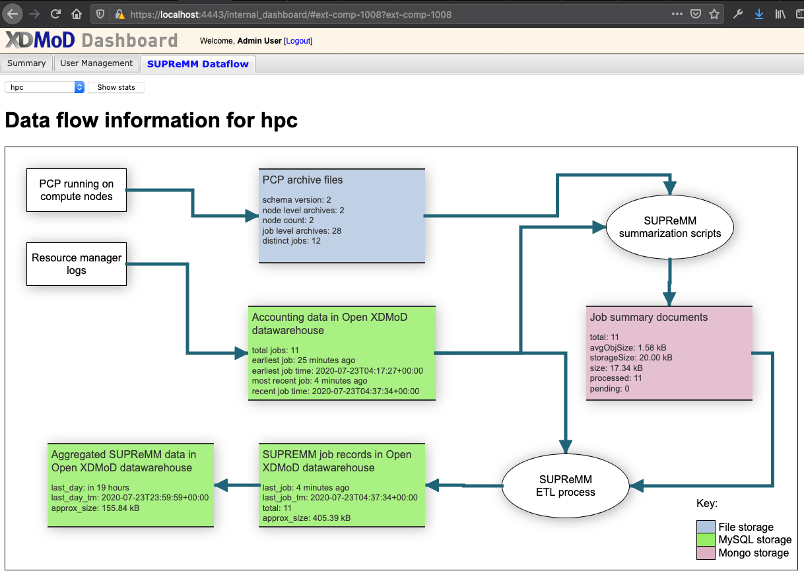

## Overview

In this part of the tutorial we are going to install and configure Open XDMoD.
The base component of Open XDMoD uses the job accounting logs from the HPC
resource manager as the data source.  We are also going to install the optional Job Performance Module. This
allows Open XDMoD to also display performance data for HPC jobs.

The asciinema media is not meant to be used on its own, they are intended for use in a "live" demonstration.

`VIM` is used to edit files in this tutorial.  If you prefer a different editor, please install it on the xdmod container.

## Submit some jobs to the cluster

Before we install and configure XDMoD we are going to submit
some HPC jobs to the cluster. These jobs will run while we go through
the install and then we will be able to view the job information
in Open XDMoD.

Login to frontend via SSH and user: `hpcadmin` password: `ilovelinux`:
```bash
ssh -p6222 hpcadmin@localhost
```

Run the provided script that submits several jobs to the cluster. These jobs
run as multiple different users with different job sizes and durations. The
purpose of this is to generate data to display in Open XDMoD. This, of course,
would not be required on a production deployment. This script should be run
as the hpcadmin user as it uses `sudo` to submit jobs as different cluster
users.
```bash
submit_jobs.sh
```

## Open XDMoD Installation

For this tutorial, the Open XDMoD software will be installed in the `xdmod` container.
Open XDMoD will use the MySQL database from the `mysql` container. Since we
will also be installing the optional Job Performance module we also run
a MongoDB database in the `mongodb` container. The various runtime scripts to process
the Job accounting and Job performance data will all be run in the `xdmod` container.

The Open XDMoD software is installed via RPMs. The majority of the software dependencies
are automatically installed via RPM. However, the `phantomjs` software
that Open XDMoD uses for its image export must be installed seperately.

The [`hpc-toolset-tutorial/xdmod/install.sh`](https://github.com/ubccr/hpc-toolset-tutorial/blob/master/xdmod/install.sh) script contains the step-by-step
instructions to install the packages.

Reference: [RPM Installation Guide](https://open.xdmod.org/install-rpm.html)

Package Installation:
[](https://asciinema.org/a/349235)

## Open XDMoD Configuration

### Prerequisites

The following information is needed by Open XDMoD:

- Name of the organization
- information for each HPC resource
    - Name
    - Number of compute nodes
    - Number of cores
    - Timezone
    - Whether it runs shared jobs

Optionally:

- An image file containing the HPC center logo
    - The width HPC center logo

Also the following technical information:

- The public url of Open XDMoD
- Paths to installed dependencies (phantomjs)
- MySQL connection information
    - Host
    - Port
    - Admin Username
    - Admin Password
    - DB Username
    - DB Password

### Prerequisites used in this Tutorial

- Name of the organization: `Tutorial` abbreviation: `hpcts`
- information for each HPC resource
    - Name: `hpc`
    - Number of compute nodes: `2`
    - Number of cores: `2`
    - Timezone: `UTC`
    - Whether it runs shared jobs: `no`
- An image file containing the HPC center logo: `/srv/xdmod/small-logo.png`
    - The width HPC center logo: `354`
- The public url of Open XDMoD:  `https://localhost:4443`
- Paths to installed dependencies (phantomjs):  `detected defaults`
- MySQL connection information
    - Host: `mysql`
    - Port: `3306`
    - Admin Username: `root`
    - Admin Password: ` leave blank `
    - DB Username: `xdmodapp`
    - DB Password: `ofbatgorWep0`

### Basic Configuration
Open XDMoD provides an interactive configuration script that performs the
database initialization and generates configuration files. This script
handles the basic setup.

The [`hpc-toolset-tutorial/xdmod/entrypoint.sh`](https://github.com/ubccr/hpc-toolset-tutorial/blob/master/xdmod/entrypoint.sh) script automates this process.

Reference: [Configuration Guide](https://open.xdmod.org/configuration.html)

The following asciinema recordings are how an administrator would do perform these actions:

General Setup:
[](https://asciinema.org/a/349236)

Database Setup:
[](https://asciinema.org/349237)

Organization Setup:
[](https://asciinema.org/349238)

Resource Setup:
[](https://asciinema.org/349240)

#### What about a Heterogeneous cluster?

The `xdmod-setup` script is used for the basic setup of Open XDMoD. The script includes options to configure the Open XDMoD database, setup the admin user account and configure resources.
Open XDMoD's [Configuration](https://open.xdmod.org/configuration.html#location-of-configuration-files) files.

Resource Specs Modification:
[](https://asciinema.org/349249)


#### Hierarchy

Open XDMoD supports a three level hierarchy.
In this tutorial we use a University Type Hierarchy.

Decanal Unit -> Department -> PI Group

Reference: [Hierarchy Guide](https://open.xdmod.org/hierarchy.html)

#### User / PI Names

Open XDMoD has the ability to import a full names.  If full names are not imported, usernames are used.


This has not been automated for this tutorial. We dont want you to fall asleep!

Create a file with the contents below:
The file needs to be able to be read by the `xdmod` user to for this demo it will be
created in /var/tmp

```bash
vim /var/tmp/names.csv
```

The first column should include the user name or group name used by your resource manager, the second column is the user’s first name and the third column is the user’s last name.
(Feel free to change the First and Last names)

```csv
cgray,Carl,Gray
sfoster,Stephanie,Foster
csimmons,Charles,Simmons
astewart,Andrea,Stewart
hpcadmin,HPC, Administrators
```

Now this needs to be imported into xdmod with the command [`xdmod-import-csv`](https://open.xdmod.org/commands.html#xdmod-import-csv)

```bash
sudo su - xdmod xdmod-import-csv -t names -i /var/tmp/names.csv
```


Reference: [User/PI Names Guide](https://open.xdmod.org/user-names.html)

xdmod-import-csv -t names:
[](https://asciinema.org/349325)


## Open XDMoD Job Performance
The Job Performance module is optional, but highly recommended.



### Job Performance Configuration

This tutorial uses the [Job Performance](https://supremm.xdmod.org) module for Open XDMoD. The Job Performance module displays job performance metric based on data collected on the HPC compute nodes.

The example in this tutorial uses [Performance Co-Pilot (PCP)](https://pcp.io)  as the performance data collection software. This must be [installed](https://github.com/ubccr/hpc-toolset-tutorial/blob/master/slurm/install.sh#L80-L87) and configured on the compute nodes.

This tutorial uses a cut-down list of PCP metrics from the recommended metrics for a production HPC system.
This shorter list is suitable for running inside the docker demo. On a
real HPC system the data collection should be setup following the
[PCP Data collection](https://supremm.xdmod.org/supremm-compute-pcp.html#configuration-templates) guide

The file used in this demo can be viewed here: https://github.com/ubccr/hpc-toolset-tutorial/blob/master/slurm/pmlogger-supremm.config#L56-L59

VERY IMPORTANT - Don't start the configuration of the Job Performance module until there is job data ingested into Open XDMoD
The Job performance setup relies on the accounting data from the Jobs realm in Open XDMoD.
This was done as part of this tutorial as part of setup and will be done again later in the tutorial.

Job Performance XDMoD Module Setup:
[](https://asciinema.org/a/349241)

Job summarization (SUPReMM) configuration:
[](https://asciinema.org/a/349243)

## Open XDMoD Operation

### Shredding Ingestion & Aggregation

Shredding
> Load logs from a scheduler (SLURM in this tutorial) and put them into the Open XDMoD databases.
> Reference: [Shredder Guide](https://open.xdmod.org/shredder.html)

Ingestion
> Prepare data that has already been loaded by the shredder into the Open XDMoD databases so that is can be queried by the Open XDMoD portal.
> Reference: [Ingestor Guide](https://open.xdmod.org/ingestor.html)

Aggregation
> What actually gets data into the Open XDMoD portal. For core xdmod this is part of ingestion.  Job Performance has a separate script.

This tutorial provides a script [`shred-ingest-aggregate-all.sh`](https://github.com/ubccr/hpc-toolset-tutorial/blob/master/xdmod/scripts/shred-ingest-aggregate-all.sh)
that does this. In a typical setup this would be part of a cron job run when it is best suited for the HPC system.

Run this now on the `xdmod` container

Login to frontend via SSH and user: `hpcadmin` password: `ilovelinux`:

```bash
ssh -p6222 hpcadmin@localhost
```
SSH to the xdmod container:

```bash
ssh xdmod
```
Run the script as the xdmod user:

```bash
sudo -u xdmod /srv/xdmod/scripts/shred-ingest-aggregate-all.sh
```
This is going to produce A LOT of output.  Each of these commands have flags that will turn this off.  For the purpose of this tutorial they have not been silenced.

[](https://asciinema.org/a/349242)

#### It is Known
-  `[WARNING] ... RuntimeWarning: invalid value encountered in double_scalars`
    -  https://stackoverflow.com/questions/27784528/numpy-division-with-runtimewarning-invalid-value-encountered-in-double-scalars/27784588#27784588
-  `[WARNING] Autoperiod library not found, TimeseriesPatterns plugins will not do period analysis`
    -  The autoperiod code is used for detecting period I/O patterns in the parallel filesystem traffic. (not needed in the tutorial configuration)

## Open XDMoD Functionality

TODO: User Dashboard

TODO: User

TODO: PI

TODO: Center

TODO: Basic Admin
### Administration

You know that the user is an admin by the addition of the "Admin Dashboard"


Admin Dashboard:


## Tutorial Navigation
[Next - OnDemand](../ondemand/README.md)  
[Previous Step - ColdFront](../coldfront/README.md)  
[Back to Start](../README.md)
